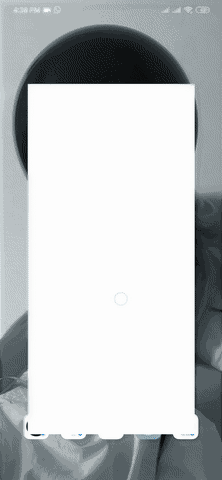

# Quotes API App

A simple working app that communicates with a quotes api -> api.quotable.io.

## Demo 

### Double API call for smooth UI

The fast respose is achieved by making two seperate calls to the api while the app starts.
 
Since this app is pretty simple and only interacts with one api and only makes the GET request, I make two GET requests when the app starts and store them in two seperat Futures. When one quote is shown to the user the other is already available on the device and hence the app responds, or atleasts seems to respond faster. 
If its still not clear think of it like this.

(quote), (nextquote) are the two Futures where two seperate quotes are stored, when one quote is shown to the user the other is already fetched and available on the device. Once the user clicks the next button the already loaded quote is shown and while the user reads it, that time is utilised to fetch and locally store another quote.

Think of it as a 1 , 2 , 1 , 2 , 1 , 2 switching.

